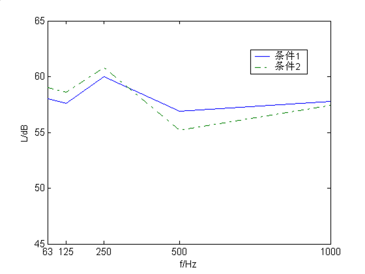

# 绪论
<!-- Quarto 项目必须要有 index.qmd 文件 -->

This is a Quarto book, to learn more about Quarto books, visit <https://quarto.org/docs/books>.

## 可听化技术概述

### 可听化的概念

可听化（Auralization）[@vorlander2008] 是近年来随着声学仿真技术的长足发展而出现的新概念，它的具体含义是通过对一包含单个（或者多个）声源的声场进行物理或数学建模，以达到声音绘制（Audio rendering）或称声学仿真（Acoustical simulation）的目的。这样，人们可以获得该声场中任意位置的双耳听觉感受。换句话说，可听化技术在客观上主要是模拟特定声场（包括声源、声传播环境以及聆听者三要素）中声音传播的物理过程，从而使其中的聆听者作为一个主体能够获得对整个场景声学特性的主观感知 [@knuth84; @lee2019; @torres2020; @zhang2021]。

本模板常用文献引用方式：

- 单条括号引用：`[@knuth84]` → [@knuth84]
- 行文引用：`@knuth84` → @knuth84
- 多条并列：`[@knuth84; @lee2019]` → [@knuth84; @lee2019]
- 连续编号压缩：`[@knuth84; @lee2019; @torres2020; @zhang2021]` → [@knuth84; @lee2019; @torres2020; @zhang2021]

使用 Markdown 语法 `@eq-n-left` 引用公式 @eq-n-left。

$$
N_{reft} = \dfrac{4\pi c^3}{3V}t^3
$$ {#eq-n-left}
$$
L_p = \int_0^\infty E(t) dt
$$ {#eq-l-p}

使用 Markdown 语法 `@tbl-algorithm-comparison` 引用表格 @tbl-algorithm-comparison。

| 方法 | A 算法 | B 算法 | C 算法 |
| ------ | ------ | ------ | ------ |
| 误差/dB | 0.86 | 1.02 | 0.69 |
| 计算时间/s | 25 | 25 | 27 |

: 三种算法的比较 {#tbl-algorithm-comparison}

{#fig-acoustic-pressure-level}

使用 Markdown 语法 `@fig-acoustic-pressure-level` 引用 @fig-acoustic-pressure-level。